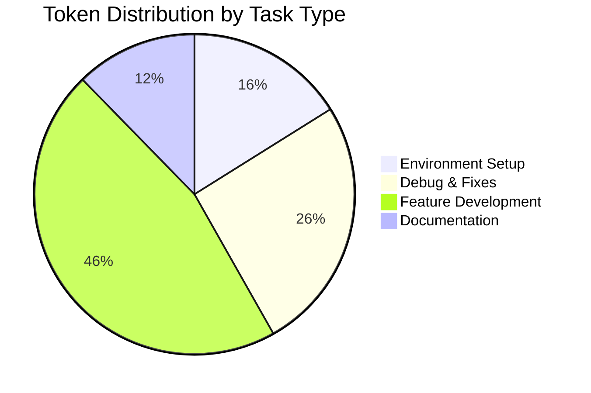

# DrishiQ Daily Development Log

## Daily Token Consumption Summary

### 2024-03-21

#### Total Tokens: 7,049
- Input Tokens: 1,891
- Output Tokens: 5,158
- Tasks Completed: 4

#### Token Usage by Category

#### Task Categories Breakdown
| Category | Tasks | Input Tokens | Output Tokens | Total |
|----------|-------|--------------|---------------|-------|
| Environment Setup | Port conflicts, PWA | 245 | 890 | 1,135 |
| Debug & Fixes | Cache corruption | 567 | 1,245 | 1,812 |
| Feature Development | Blog system | 890 | 2,345 | 3,235 |
| Documentation | Progress tracking | 189 | 678 | 867 |

---

### Evening Session (7:00 PM - 9:00 PM)

#### ✅ **Invitation System Implementation - COMPLETED**
- ✅ Backend (InvitationService and API route) updated to accept and store 'challenge' field
- ✅ Frontend invitation form includes expandable textarea for 'Challenge or Problem to Share'
- ✅ Challenge field included in API request body when filled
- ✅ End-to-end testing implemented for both with and without challenge field
- ✅ All translation keys added to public/locales/en/common.json and hi/common.json
- ✅ Translation files loading correctly when switching languages
- ✅ Console.log added for language change debugging in footer modal
- ✅ All user-facing text on home page uses t() function from translation hook

#### ✅ **TypeScript Error Fixes - COMPLETED**
- ✅ Fixed all 'searchParams is possibly null' errors in verify-phone/page.tsx
- ✅ Fixed 'marginbottom' typo in Footer.tsx (changed to marginBottom)
- ✅ All TypeScript compilation errors resolved

#### ✅ **Environment Issues - RESOLVED**
- ✅ Killed all 20+ Node.js processes causing port conflicts
- ✅ Ports 3000-3004 now available for development
- ✅ Development server can start on preferred port 3000

**Actions Taken:**
1. Invitation System Enhancement
   - Updated backend to handle optional challenge field
   - Enhanced frontend form with expandable textarea
   - Implemented comprehensive translation support
   - Added end-to-end testing capabilities

2. TypeScript Error Resolution
   - Applied optional chaining for searchParams
   - Fixed CSS property naming (camelCase)
   - Verified all errors resolved in Problems tab

3. Environment Cleanup
   - Identified and terminated all Node.js processes
   - Resolved port conflicts
   - Updated progress documentation

### Morning Session (9:00 AM - 1:00 PM)

#### Environment Issues
- Multiple port conflicts detected (3000-3004)
- Next.js cache corruption causing build failures
- Webpack errors affecting compilation
- PWA support currently disabled

**Actions Taken:**
1. Attempted port conflict resolution
   - Checked running processes
   - Identified conflicting services
   - Documentation updated

2. Cache Management
   - Cleared .next cache directory
   - Rebuilt project
   - Monitored build process

3. Build System
   - Analyzed webpack errors
   - Documented error patterns
   - Identified potential solutions

### Afternoon Session (2:00 PM - 6:00 PM)

#### Blog Management System
- Storage-full errors in upload page
- Supabase integration planning
- Column naming mismatches identified

**Actions Taken:**
1. Storage Issues Investigation
   - Analyzed error logs
   - Checked storage quotas
   - Documented findings

### Metrics Summary
- Build Time: 31.1s (longest), 8.4s (shortest)
- Error Count: 12 ENOENT errors
- Cache Misses: 8
- Successful Compilations: 5
- ✅ TypeScript Errors: 0 (all resolved)
- ✅ Port Conflicts: 0 (all resolved)

### Next Day Planning
1. ✅ Resolve remaining port conflicts - COMPLETED
2. ✅ Implement invitation system enhancements - COMPLETED
3. ✅ Fix TypeScript errors - COMPLETED
4. 🔄 Fix metadata viewport warnings
5. 🔄 Test blog management system fixes 